Which neighborhoods in San Francisco offer tourists private rooms that fit their budget, are safe (crime-wise), close to Downtown and attractions?

Let's find out what variables can help us discover which neighborhoods in San Francisco have the best (according to considerations above) private rooms to rent!

This research aims to help tourists decide where their ideal locality will be  in "The Golden City".


#Phase 1 of analysis:


The data was obtained from Kaggle, including 16 variables and 7833 observations. After data cleaning there are 7 variables and 2064 observations.
Variables considered were: Neighborhood, Price, reviews_per_month, reviews_total, availability_365,  minimum_nights and calculated_host_listings_count.


Files first included:


Listings.xlsx- where all listings for Airbnbs in San Francisco are found. Including details like: number_id of listing, name, host_name, neighborhood, room_type, price, and many more interesting features.   


PrivateRooms.csv- which includes all Airbnbs private rooms from listings. Including all details above.

Reviews.csv-includes listing_id and date of reviews.

Gathering necessary information from listings.xlsx.


Here is the Listings data frame: 
With 7833 observations of 16 variables 


There are 2885 private rooms. Private rooms' prices per night were decreased to $250.


```r
boxplot(dt4$price, col=(c("orange")), main="Price of Private-Rooms", xlab=" ", ylab="Prices")
```

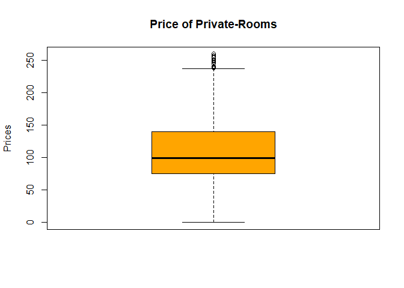<!-- -->

Boxplots were also created for minimum_nights, reviews_per_month, reviews_total, calculated_host_listings_count and availability_365.
After closely observing those boxplots, outliers were removed as well as NA values.
Those boxplots now present a cleaner organization of the PrivateRooms.csv data.


A cleaned1.csv file was created with a data frame including all variables after cleaning their boxplots and reorganizing the data in a way all observations would match. The 35 Neighborhoods were abbreviated to a three-letter acronym, and now we are left with 2064 observations. 


Those neighborhoods were then turned numerical to run tests against other variables. Subsequently, stored in 10 categorical subsets. Those subsets were created based on proximity to neighborhoods, saved under clean_sub.csv.


MATRIX OF NEIGHBORHOOD SUBSETS:


```
##        Based_on_Proximity
## Subsets Neighborhoods                                                                                    
##      1  "Financial District(Fnd), ChinaTown(Chn), Nob Hill(NbH)"                                         
##      2  "Marina(Mrn), North Beach(NrB), Russian Hill(RsH)"                                               
##      3  "Inner Richmond(InR), Outer Richmond(OtR), Seacliff(ScI), Golden Gate Park(GGP)"                 
##      4  " Mission(Mss), Potrero Hill(PtH), Castro Upper Market(C/M), Haight Ashbury(HgA)"                
##      5  "Pacific Heights(PcH), Presidio Heights(PrH), Western Addition(WsA)"                             
##      6  "Downtown/Civic Center(D/C), South Of Market(SoM)"                                               
##      7  "Crocker Amazon(CrA), Ocean View(OcV), Outer Mission(OOO)"                                       
##      8  "Inner Sunset-(InS), Outer Sunset(OtS), West of Twin Peaks(WoTP), Twin Peaks(TwP), ParkSide(Prk)"
##      9  "Noe Valley(NVI), Glen Park(GlP), Diamond Heights(DmH)"                                          
##      10 "Bay View(Byv), Visitation Valley(VsV), Excelsior(Exc), Bernal Heights(BrH)"
```


A barplot of "clean_sub" was created to analyze neighborhood subsets against price per private room. On this barplot it can observed that subset number 4(which includes: Mission(Mss), Potrero Hill(PtH), Castro Upper Market(C/M), Haight Ashbury(HgA)), with 455 private rooms available has the greatest price change per room, with maximum price being over $400. 
Hence, after merging these neighborhoods together from decreased $250 price per night, per neighborhood, there's an increase of $150 when considering subsets of neighborhoods.  


```r
barplot(table(j), main = "Neighborhoods-Prices", xlab = "Prices", ylab = "Neighborhood-Subsets", horiz=TRUE, las=1, col="blue")
```

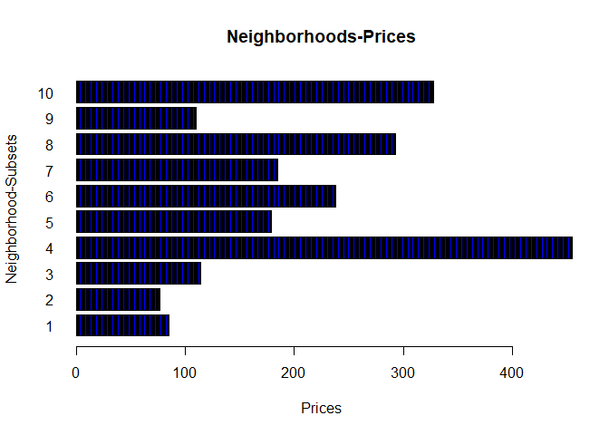<!-- -->

Barplot "Neighborhoods-Prices", shows how subset #4- Mission(Mss), Potrero Hill(PtH), Castro Upper Market(C/M), Haight Ashbury(HgA), with 455 private rooms available has the greatest price change per rooms, as it has the most rooms available.


A boxplot was also created to show price variation of neighborhood subsets:


```r
boxplot(dt9, main = "Private_Rooms", xlab = "Neighborhoods", ylab = "Price",horiz=TRUE, las=1, col=c(5,3))
```

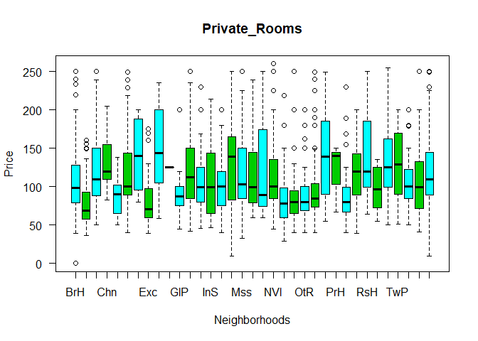<!-- -->


Above, is the boxplot of all neighborhoods and their acronym showing how they differ in price. 

Another data frame was created named last_df1. Containing all 2064 observations with 8 variables including neighborhood subsets and neighborhoods acronyms. With this data frame further analysis can be made. 
The first variables to be analyzed were Neigb_Sub and Price.


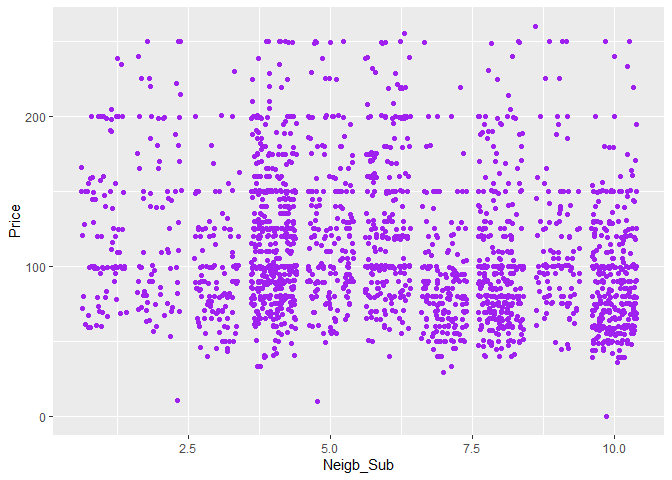<!-- -->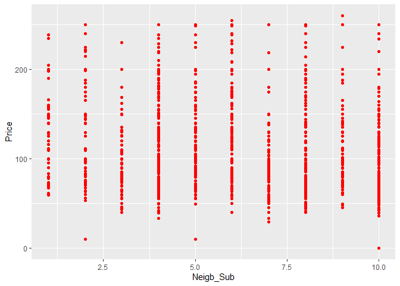<!-- -->

```
## `geom_smooth()` using method = 'gam' and formula 'y ~ s(x, bs = "cs")'
```

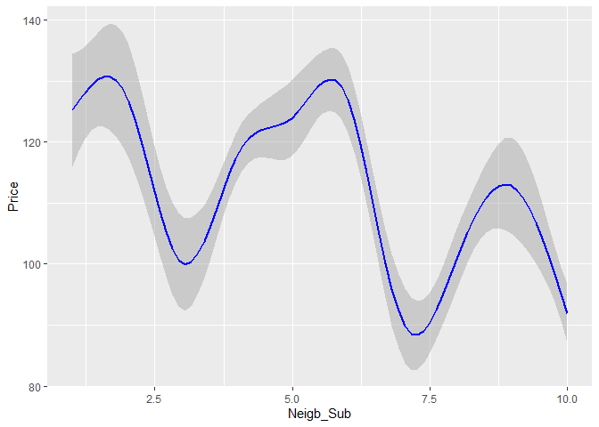<!-- -->

```
## Warning: `fun.y` is deprecated. Use `fun` instead.
```

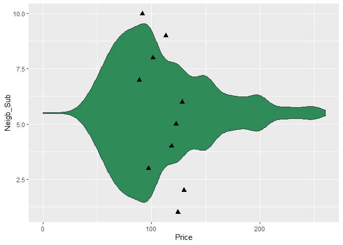<!-- -->

Above it can be noticed that:

1st graph: neighborhood subset #4- Mission(Mss), Potrero Hill(PtH), Castro Upper Market(C/M), Haight Ashbury(HgA), has the most private rooms to rent, and with that information it can be explained how spread the points(prices) are do to the amount of rooms available.

2nd graph: neighborhood subset #9- Noe Valley(NVI), Glen Park(GlP), Diamond Heights(DmH) with 110 private rooms available has just a few rooms that are over $200 per night stay.

3rd graph: neighborhood subset #2- Marina(Mrn), North Beach(NrB), Russian Hill(RsH), has the highest price per subsets.

4th graph: it can be observed that neighborhood subset #2- Marina(Mrn), North Beach(NrB), Russian Hill(RsH), has the highest mean value for prices of its 77 private rooms.


A box plot was also created support claims made so far, about neighborhood subsets:


```r
gp5=boxplot(Price~Neigb_Sub, data=last_df1, col=(c("pink","purple")), main = "Prices per Neighborhood_Subset", xlab="Neigb_Sub", ylab="Price", las=1)
```

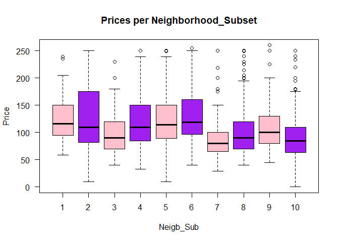<!-- -->

Boxplot above reinforces previous graphs showing how neighborhood subset 
2- Marina(Mrn), North Beach(NrB), Russian Hill(RsH) is the most expensive subset for last_df1 dataframe. 


#Result of first analysis:


After analysing box plots, barplots, geom_jitter etc, for price against neighborhoods then price against neighborhood-subsets, results show that neighborhood subset 2- Marina(Mrn), North Beach(NrB), Russian Hill(RsH), with 77 private rooms has the highest price per subset. Perhaps, because it has the least amount of private rooms per subset?
Further analysis will explain the price of those subsets when it comes to how safe they are, and how close they are to famous attractions. Let's find out!


#Phase 2 of analysis:


Subsets of neighborhoods were examined in regards to how safe they were. Afterwards, a numerical safe subset was created, subsetted into 5 different categories: (1-2)-highest safety, (3-4)- high safety, (5-6)- low safety, (7,8)- lower safety, and lastly (9,10)- lowest safety. Safety was based on the rate of annual crime, violent crimes and property theft reports for 2019.


Neighborhood-Subsets subesetted from (1-10)
1= Most Safe
10= Not Safe

MATRIX OF SAFE-NEIGHBORHOOD SUBSETS:


```
##             Based_on_Crime_Reports
## Safe_Subsets Neighborhoods                                                                                    
##           1  "Crocker Amazon(CrA), Ocean View(OcV), Outer Mission(OOO)"                                       
##           2  "Inner Richmond(InR), Outer Richmond(OtR), Seacliff(ScI), Golden Gate Park(GGP)"                 
##           3  "Noe Valley(NVI), Glen Park(GlP), Diamond Heights(DmH)"                                          
##           4  "Inner Sunset-(InS), Outer Sunset(OtS), West of Twin Peaks(WoTP), Twin Peaks(TwP), ParkSide(Prk)"
##           5  "Downtown/Civic Center(D/C), South Of Market(SoM)"                                               
##           6  "Financial District(Fnd), ChinaTown(Chn), Nob Hill(NbH)"                                         
##           7  "Pacific Heights(PcH), Presidio Heights(PrH), Western Addition(WsA)"     
##           8  "Bay View(Byv), Visitation Valley(VsV), Excelsior(Exc), Bernal Heights(BrH)"                     
##           9  "Marina(Mrn), North Beach(NrB), Russian Hill(RsH)"                                               
##           10 "Mission(Mss), Potrero Hill(PtH), Castro Upper Market(C/M), Haight Ashbury(HgA)"
```

A geometric jitter plot, with level of safety(cat_sub) against safe subsets(safe_sub). 


             


```r
sf4<-ggplot(safe_df, aes(x=cat_sub, y=safe_sub, color="green")) + geom_point()
sf4 + geom_jitter(aes(colour = cat_sub))
```

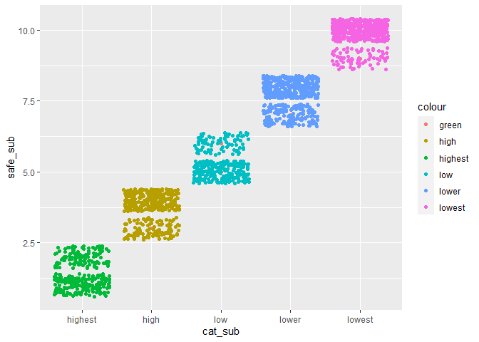<!-- -->

```r
sf4
```

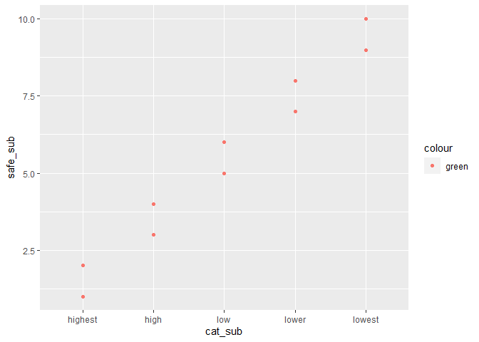<!-- -->
It can be observed that safe_subs (1-2) have the highest safety of all subsets. Those subsets are: #1: Crocker Amazon(CrA), Ocean View(OcV), Outer Mission(OOO), and #2: Inner Richmond(InR), Outer Richmond(OtR), Seacliff(ScI), Golden Gate Park(GGP). Subset #1 has the highest concentraction of safety in comparison to subset #2. While subsets (9-10) have the lowest safety, those are: #9: Marina(Mrn), North Beach(NrB), Russian Hill(RsH) and #10: Mission(Mss), Potrero Hill(PtH), Castro Upper Market(C/M), Haight Ashbury(HgA). Subset #10 has the lowest concentration of safety in comparison to subset #9.


For further analysis of safe_sub and cat_sub, a Chi-Square test was conducted.

#Chi-square test of independence

Contingency table


```r
sfx0=table(safe_df$safe_sub, safe_df$cat_sub)
sfx0
```

```
##     
##      highest high low lower lowest
##   1      185    0   0     0      0
##   2      114    0   0     0      0
##   3        0  110   0     0      0
##   4        0  293   0     0      0
##   5        0    0 238     0      0
##   6        0    0  85     0      0
##   7        0    0   0   179      0
##   8        0    0   0   328      0
##   9        0    0   0     0     77
##   10       0    0   0     0    455
```


```r
test0 <- chisq.test(table(safe_df$safe_sub, safe_df$cat_sub))
test0
```

```
## 
## 	Pearson's Chi-squared test
## 
## data:  table(safe_df$safe_sub, safe_df$cat_sub)
## X-squared = 8256, df = 36, p-value < 2.2e-16
```
The claim thats on trial is the null hypothesis:

H_o: There is no relationship between the popularity of neighborghood subsets and safety.

H_a: There is a relationship between the popularity of neighborghood subsets and safety.

Therefore, p-value is 2.2e-16 < 0.05, we reject the null hypothesis and accept the alternative hypothesis: There is a relationship between the popularity of neighborghood subsets and safety.


#Result of second analysis:

Above it can be seen that the Chi-Square test supports the evidence presented with the on the geometric jitter plot. 
_safe_sub number (1-2) having the highest safety and 299 private rooms, but yet not being the considered the most famous of the subsets.
_safe_sub number (9-10) having the lowest safety and 532 private rooms, and being considered to be one of the most famous subsets. 

 The p-value obtained from Chi-Square is statistically significant, and we ignore the null hypothesis, and opt to stay with the alternative hypothesis:
 H_a: There is a relationship between the popularity of neighborghood subsets and safety.
 
 As observed above, the safest subset #1: Crocker Amazon(CrA), Ocean View(OcV), Outer Mission(OOO), and #2: Inner Richmond(InR), Outer Richmond(OtR), Seacliff(ScI), Golden Gate Park(GGP), is not as popular as the lowest safety subset #9: Marina(Mrn), North Beach(NrB), Russian Hill(RsH) and #10: Mission(Mss), Potrero Hill(PtH), Castro Upper Market(C/M), Haight Ashbury(HgA).
Therefore, safety level of neighborhood subsets is not the main criteria involved when selecting which airbnb private room to rent in San Francisco.


#Phase 3 of analysis:

How much does being close to attractions affect the price of private rooms? 

For phase number three of the analysis, the focus is on finding out which neighborhood subset is closer to famous attractions. And if whether or not the fact of being closer to those attractions changes the price of private rooms to rent. 

The safe subset of neighborhoods first created was used to create new subsets of neighborhoods close to attractions from (1-10). Which was then turned into a subset(cat_sub) where: (1-2) is nearest to famous attractions, (3-4) is nearer, (5-6) near, (7-8) further and (9-10) furthest from famous attractions. 


MATRIX OF SAFE-SUBSETS CLOSE TO ATTRACTIONS:


```
##        Based_on_Proximity_to_Attractions
## Subsets Neighborhoods                                                                                    
##      1  "Marina(Mrn), North Beach(NrB), Russian Hill(RsH)"                                               
##      2  "Inner Richmond(InR), Outer Richmond(OtR), Seacliff(ScI), Golden Gate Park(GGP)"                 
##      3  "Inner Sunset-(InS), Outer Sunset(OtS), West of Twin Peaks(WoTP), Twin Peaks(TwP), ParkSide(Prk)"
##      4  "Financial District(Fnd), ChinaTown(Chn), Nob Hill(NbH)"                                         
##      5  "Downtown/Civic Center(D/C), South Of Market(SoM)"                                               
##      6  "Pacific Heights(PcH), Presidio Heights(PrH), Western Addition(WsA)"       
##      7  "Mission(Mss), Potrero Hill(PtH), Castro Upper Market(C/M), Haight Ashbury(HgA)"                 
##      8  "Crocker Amazon(CrA), Oceanview(OcV), Outer Mission(OOO)"                                        
##      9  "Noe Valley(NVI), Glen Park(GlP), Diamond Heights(DmH)"                                          
##      10 "Bayview(Byv), Visitation Valley(VsV), Excelsior(Exc), Bernal Heights(BrH)"
```


A test to conduct non-parametric estimation was selected.
Kernel regression is a nonparametric regression method that allows us to capture the underlying structure.


```r
Kreg3 = ksmooth(x=safe_df1$fam_attr,y=Price,kernel = "normal",bandwidth = 0.9) 
plot(safe_df1$fam_attr,Price,pch=20) 
lines(Kreg3, lwd=4, col="orange")
```

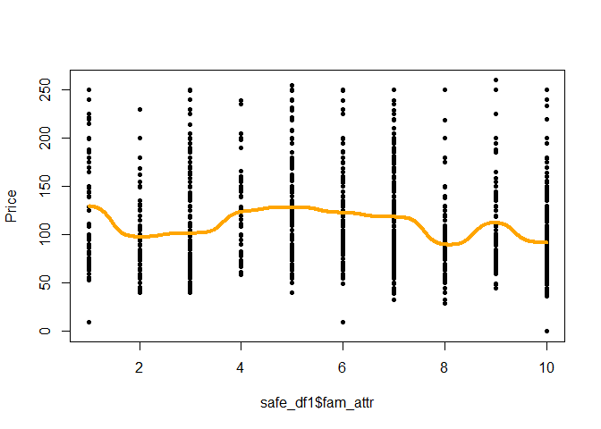<!-- -->

Famous attraction subset is positively related with price. The closest the subset is to famous attractions the most expensive the private rooms are. The furthest from famous attractions the cheaper the private rooms are. 


```r
cor(safe_df1$fam_attr, Price)
```

```
## [1] -0.1116631
```

This correlation shows how the relationship between famous attractions and price is positive, when subset is close to famous attractions the more expensive it is. Price vs. famous attractions has a negative relationship, meaning that the far away the subset is from famous attractions, the cheaper the subset is.


Plots were created for visualization of safe subsets when it comes to level of safety and proximity to famous attractions:

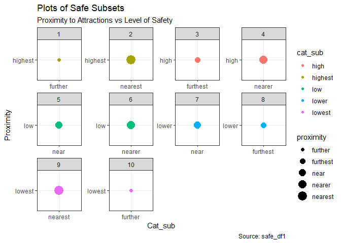<!-- -->


```
## `geom_smooth()` using formula 'y ~ x'
```

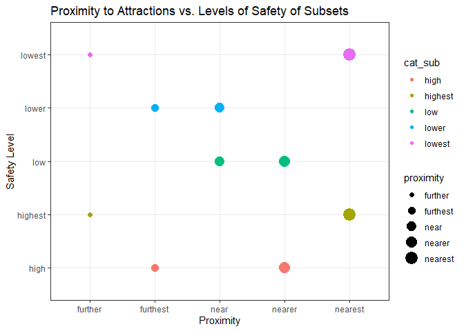<!-- -->
On scatterplot above, it can be seen that the highest safety neighborhood sub is further from famous attractions. Now, the lowest safety neighborhood sub is nearest to most famous attractions.


DATA FRAME OF ATTRACTIONS:


```
##    Subsets Level_of_Proximity
## 1        1            Nearest
## 2        2            Nearest
## 3        3             Nearer
## 4        4             Nearer
## 5        5               Near
## 6        6               Near
## 7        7            Further
## 8        8            Further
## 9        9           Furthest
## 10      10           Furthest
##                                                                       Proximity_to_Attractions_Sub
## 1                                                 Marina(Mrn), North Beach(NrB), Russian Hill(RsH)
## 2                   Inner Richmond(InR), Outer Richmond(OtR), Seacliff(ScI), Golden Gate Park(GGP)
## 3  Inner Sunset-(InS), Outer Sunset(OtS), West of Twin Peaks(WoTP), Twin Peaks(TwP), ParkSide(Prk)
## 4                                           Financial District(Fnd), ChinaTown(Chn), Nob Hill(NbH)
## 5                                                 Downtown/Civic Center(D/C), South Of Market(SoM)
## 6         Pacific Heights(PcH), Presidio Heights(PrH), Western                       Addition(WsA)
## 7                   Mission(Mss), Potrero Hill(PtH), Castro Upper Market(C/M), Haight Ashbury(HgA)
## 8                                          Crocker Amazon(CrA), Oceanview(OcV), Outer Mission(OOO)
## 9                                            Noe Valley(NVI), Glen Park(GlP), Diamond Heights(DmH)
## 10                       Bayview(Byv), Visitation Valley(VsV), Excelsior(Exc), Bernal Heights(BrH)
##                                                                                                         Top5_Attractions
## 1                                   Fisherman's Wharf, Lombard Street, Alcatraz Island, Pier 39, The Exploratorium
## 2        Golden Gate Park, California Academy of Science, Golden Gate Bridge, Legion Of Honor, Presidio of San Francisco
## 3               Golden Gate Park, San Francisco Botanical Garden, Califonia Academy of Sciences, Twin Peaks, Ocean Beach
## 4                                        The Exploratorium, Dragon Gate, Transamerica Pyramid, Ferry Building, Cable Car
## 5         Union Square, San Francisco Museum of Modern Arts, Bill Graham Civic Auditorium, Asian Art Museum, Oracle Park
## 6                 Presidio of San Francisco, Golden Gate Bridge, The Painted Ladies, The Palace of Fine Arts, Japan Town
## 7             Golden Gate Park, The Painted Ladies, The Castro Theater, Mission Dolores Park, San Francisco Pride Parade
## 8  Balboa Park, San Francisco Golf Club, Croker Amazon Playground, San Bruno Mountain State and County Park, Brooks Park
## 9               Glen Park Festival, Mission Dolores Park, Glen Canyon Park, Twin Peaks, Bird & Beckett Books and Records
## 10                         Balboa Park, John McLaren Park, Bernal Heights Park, Speakeasy Brewery, Laughing Monk Brewing
```
Above can be seen how subset-1 is nearest the most famous attractions, and what those famous attractions are.

Wrapping up how proximity to famous attractions affects the price of private rooms:


#Chi-Square test of independence:

Was conducted to find out if most of the neighbohood subsets closer to attractions are not safe.


Contingency table


```r
sfx=table(safe_df1$proximity, safe_df1$cat_sub)
sfx
```

```
##           
##            high highest low lower lowest
##   further     0     185   0     0    455
##   furthest  110       0   0   328      0
##   near        0       0 238   179      0
##   nearer    293       0  85     0      0
##   nearest     0     114   0     0     77
```

Nearest to famous attractions subset safe_sub #9(Marina, North Beach, Russian Hill) has the lowest level of safety with 77 private rooms, safe_sub #1(Crocker Amazon, Ocean View, Outer Mission), has highest safety with 185 private rooms and is further from famous attractions.


Running Chi-square test of independence


```r
test <- chisq.test(table(safe_df1$proximity, safe_df1$cat_sub))
test
```

```
## 
## 	Pearson's Chi-squared test
## 
## data:  table(safe_df1$proximity, safe_df1$cat_sub)
## X-squared = 3757.8, df = 16, p-value < 2.2e-16
```

The claim thats on trial is the null hypothesis:

H_o: There is no relationship between neighborhood subsets close to attractions and safety.

H_a: There is a relationship between neighborhood subsets close to attractions and safety.

Therefore, p-value is 2.2e-16 < 0.05, we reject the null hypothesis, and accept the alternative hypothesis: There is a relationship between neighborhood subsets close to attractions and safety.


```r
round(test$residuals, 3)
```

```
##           
##               high highest     low   lower  lowest
##   further  -11.179   9.584 -10.008 -12.538  22.582
##   furthest   2.647  -7.966  -8.279  21.249 -10.625
##   near      -9.023  -7.772  21.384   7.565 -10.367
##   nearer    25.514  -7.400   3.360  -9.636  -9.871
##   nearest   -6.107  16.412  -5.467  -6.850   3.958
```
Residuals are positive for safe_subs, meaning they have a positive association between safety levels and proximity to attractions.


Lastly, a Least Squares regression model was used to analyse price~safe_df1$fam_attr.


```r
library(ISLR)
lm.fit=lm(Price~safe_df1$fam_attr, data = last_df1)
lm.fit
```

```
## 
## Call:
## lm(formula = Price ~ safe_df1$fam_attr, data = last_df1)
## 
## Coefficients:
##       (Intercept)  safe_df1$fam_attr  
##           122.030             -1.958
```


```r
summary(lm.fit)
```

```
## 
## Call:
## lm(formula = Price ~ safe_df1$fam_attr, data = last_df1)
## 
## Residuals:
##     Min      1Q  Median      3Q     Max 
## -110.07  -33.32  -12.24   25.62  155.60 
## 
## Coefficients:
##                   Estimate Std. Error t value Pr(>|t|)    
## (Intercept)       122.0298     2.5731  47.424  < 2e-16 ***
## safe_df1$fam_attr  -1.9584     0.3838  -5.102 3.66e-07 ***
## ---
## Signif. codes:  0 '***' 0.001 '**' 0.01 '*' 0.05 '.' 0.1 ' ' 1
## 
## Residual standard error: 45.96 on 2062 degrees of freedom
## Multiple R-squared:  0.01247,	Adjusted R-squared:  0.01199 
## F-statistic: 26.03 on 1 and 2062 DF,  p-value: 3.66e-07
```

The claim thats on trial is the null hypothesis:

H_o: Proximity to famous attractions doesn't affect the prices of private rooms.

H_a: Proximity to famous attractions affect the prices of private rooms.

Above the p-value is 3.66e-07 < 0.05. 
We reject the null hypothesis and can conclude that the interaction between the price of private rooms and proximity to famous attractions are important for this model.
Adjusted R-squared is only 1%, it explains a very small variability of prices.
F-statistic: is much larger than 1, we can reject the null hypothesis. 


```r
summary(lm.fit)
```

```
## 
## Call:
## lm(formula = Price ~ safe_df1$fam_attr, data = last_df1)
## 
## Residuals:
##     Min      1Q  Median      3Q     Max 
## -110.07  -33.32  -12.24   25.62  155.60 
## 
## Coefficients:
##                   Estimate Std. Error t value Pr(>|t|)    
## (Intercept)       122.0298     2.5731  47.424  < 2e-16 ***
## safe_df1$fam_attr  -1.9584     0.3838  -5.102 3.66e-07 ***
## ---
## Signif. codes:  0 '***' 0.001 '**' 0.01 '*' 0.05 '.' 0.1 ' ' 1
## 
## Residual standard error: 45.96 on 2062 degrees of freedom
## Multiple R-squared:  0.01247,	Adjusted R-squared:  0.01199 
## F-statistic: 26.03 on 1 and 2062 DF,  p-value: 3.66e-07
```

```r
plot(lm.fit)
```

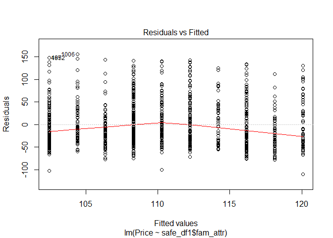<!-- -->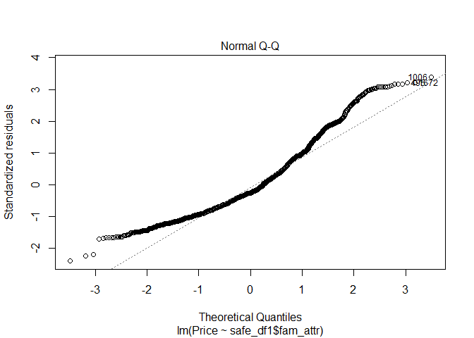<!-- -->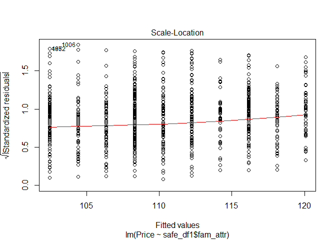<!-- -->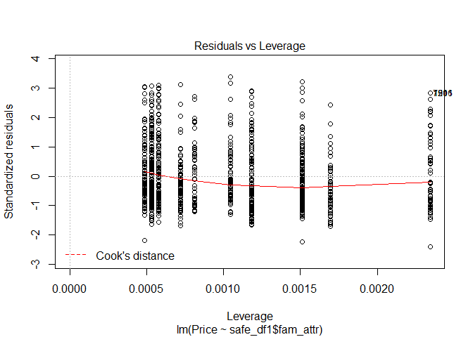<!-- -->


The closest to 0 the better the fit. And the regression line of model is really close to 0

4 graphs:

1)Residuals$fitted_values
Linearity assumption: the plot of the residuals against the fitted values form a horizontal line around 0, then we can say that the dependent variable is linearly related to the independent variable.

2)Normal Q-Q
#All the points dont fall exactly on diagonal line. Meaning that we have some deviation from normality here

3)Scale-Location
x= Fitted values
y=sqr|Standardized residuals|

4)Residuals vs Leverage
x=Leverage
y=Standardized residuals


```r
boxplot(Price~safe_df1$fam_attr, col=(c("red")), main="Price of Private Rooms close to Attractions", xlab="Famous Attractions", ylab="Prices")
```

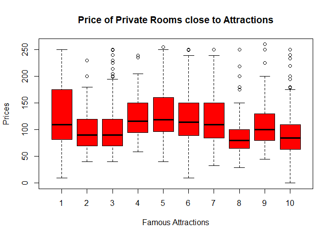<!-- -->

Boxplot of "Price of Private Rooms close to Attractions" demonstrates how for example subset (1): Marina(Mrn), North Beach(NrB), Russian Hill(RsH), which contains 77 private rooms, has the largest variation in prices. The distribution of its boxplot is positively skewed, meaning that most of the prices are clustered around the left tail of the distribution, while the right tail of the distribution is longer. Thus, on the right tail we find less private rooms that are more expensive than those on the left tail. 
Subset (10): Bayview(Byv), Visitation Valley(VsV), Excelsior(Exc), Bernal Heights(BrH), which contains 328 private rooms, contain whiskers observations that are distant from rest of data. The boxplot itself is symmetrically distributed, and mean price falls under $100. 
Therefore, it can be said that subsets closer to famous attractions have fewer rooms that are much more expensive than subsets that are distant from famous attractions and have many more private rooms.


#Result of third analysis:

Famous attraction subset is negatively related with price. When private rooms are expensive, the closer they are to famous attractions. The further they are from famous attractions, the cheaper the price for private rooms are.
By using Chi-Square test of independence, we found that there is a relationship between neighborhood subsets close to attractions and safety.
Ultimately, the Least Squares regression model showed that proximity to attractions affects the price of private rooms.
Hence, after interpreting different plots and tests, the data can confirm that there is a relationship between safe neighborhoods close to attractions and how much their private rooms cost. The closer they are to famous attractions, the more expensive the private rooms will be.


#Conclusion:

Results (from first created subset) before creating subsets of safety and attractions, showed how subset (2): Marina(Mrn), North Beach(NrB), Russian Hill(RsH), was the most expensive subset. 
When it comes to safety, the least popular subsets have the highest safety. Like safe_sub (1): Crocker Amazon(CrA), Ocean View(OcV), Outer Mission(OOO), and (2): Inner Richmond(InR), Outer Richmond(OtR), Seacliff(ScI), Golden Gate Park(GGP). In comparison to the lowest safety subs like (9): Marina(Mrn), North Beach(NrB), Russian Hill(RsH) and (10): Mission(Mss), Potrero Hill(PtH), Castro Upper Market(C/M), Haight Ashbury(HgA), which contain the most popular, known neighborhoods in San Francisco.
Now, when it comes to attractions, it is very clear that the subsets closer to famous attractions are the most expensive ones. The further they are from attractions, the cheapest they becomes.
Consequently, it follows that safety is not the main criteria when selecting which neighborhood to stay. Being close to popular neighborhoods which involve being close to the most famous attractions, is far more important than safety criteria of neighborhood. 


#Acknowledgements:

Information about safety of neighborhoods can be found here:

https://www.areavibes.com/san+francisco-ca
https://trip101.com/article/safe-neighborhoods-in-san-francisco
https://www.onlyinyourstate.com/northern-california/san-francisco/safest-san-francisco/
https://trip101.com/article/safe-neighborhoods-in-san-francisco
https://www.niche.com/places-to-live/search/safest-neighborhoods/m/san-francisco-metro-area/


Information about neighborhood attractions can be found here:

https://www.tripadvisor.com/Attractions-g60713-Activities-a_allAttractions.true-San_Francisco_California.html
https://www.sftravel.com/article/top-20-attractions-san-francisco
https://travel.usnews.com/San_Francisco_CA/Things_To_Do/


